# Bezpieczeństwo rozwiązań chmurowych
## Temat: Budowa bezpiecznego potoku CI/CD, IaC do wdrażania konteneryzowanej aplikacji webowej na platformie AWS Elastic Beanstalk.

### 1. Wprowadzenie

Celem projektu jest wdrożenie i zabezpieczenie konteneryzowanej, wielowarstwowej aplikacji webowej BookVibe w chmurze publicznej Amazon Web Services. Główny nacisk położono na implementację  mechanizmów bezpieczeństwa, automatyzację infrastruktury oraz budowę bezpiecznego potoku CI/CD.

**Zastosowane technologie:**
*   **Aplikacja:** React.js (frontend), Spring Boot (backend), MySQL (baza danych), Redis (cache/blacklist).
*   **Infrastruktura:** AWS (Elastic Beanstalk, RDS, ElastiCache, VPC, IAM, ECR, EC2, Secrets Manager).
*   **Automatyzacja i bezpieczeństwo:** Terraform (infrastruktura jako kod), Docker (konteneryzacja), GitHub Actions (CI/CD), Trivy (skanowanie bezpieczeństwa obrazów Docker).

### 2. Architektura rozwiązania

Aplikacja została wdrożona w architekturze wielowarstwowej w ramach izolowanej sieci wirtualnej (VPC) w AWS, z wyraźnym podziałem na strefy bezpieczeństwa.

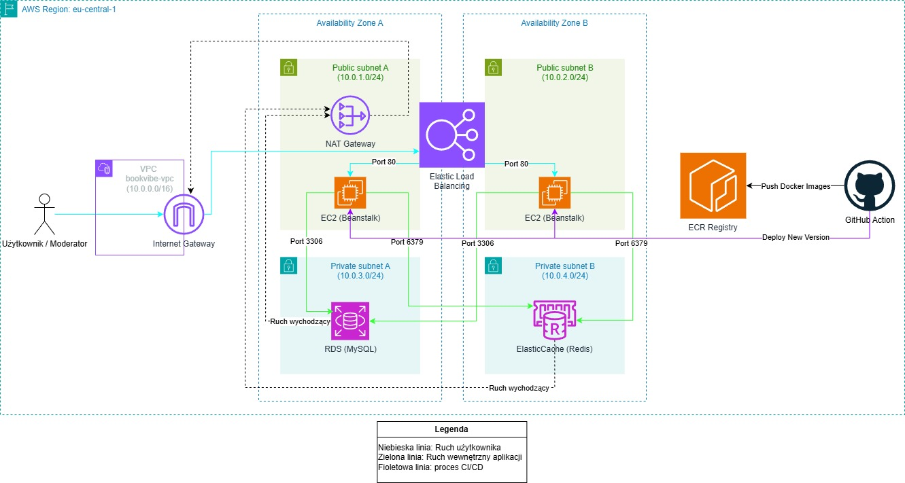
*Rys. 2.1. Diagram architektury*

**Opis komponentów architektury:**

*   **Warstwa dostępowa (Internet Gateway & Elastic Load Balancer):** Ruch inicjowany przez użytkownika z publicznego internetu wchodzi do sieci VPC przez bramę internetową (Internet Gateway). Następnie jest on kierowany do Application Load Balancera, który działa w podsieciach publicznych. Load Balancer pełni rolę jedynego punktu wejścia dla ruchu aplikacyjnego (port 80), równoważy obciążenie i przekazuje zweryfikowane żądania do warstwy aplikacyjnej.
*   **Warstwa aplikacyjna (AWS Elastic Beanstalk):** Kontenery z aplikacją frontendową (Nginx) i backendową (Spring Boot) działają na instancjach EC2 (`t3.micro`) zarządzanych przez usługę AWS Elastic Beanstalk. Zgodnie z diagramem, instancje te są umieszczone w podsieciach publicznych, co umożliwia im komunikację z Load Balancerem. Kluczowym elementem bezpieczeństwa jest jednak grupa bezpieczeństwa (`bookvibe-beanstalk-sg`), która ściśle filtruje ruch przychodzący, zezwalając na połączenia na porcie 80 wyłącznie z Application Load Balancera, a nie bezpośrednio z internetu.
*   **Warstwa danych (Amazon RDS & ElastiCache):** Baza danych MySQL (Amazon RDS) oraz cache Redis (Amazon ElastiCache) są umieszczone w podsieciach prywatnych, co zapewnia ich całkowitą izolację od publicznego internetu. Dostęp do tych usług jest możliwy wyłącznie z instancji warstwy aplikacyjnej na dedykowanych portach (3306 dla MySQL, 6379 dla Redis), co jest egzekwowane przez grupy bezpieczeństwa (`bookvibe-db-sg`, `bookvibe-redis-sg`). Ruch wychodzący z tej warstwy do internetu (np. w celu pobrania aktualizacji) jest możliwy dzięki bramie NAT Gateway.

### 3. Zaimplementowane mechanizmy bezpieczeństwa

Poniżej znajduje się opis konfiguracji poszczególnych elementów infrastruktury oraz uzasadnienie podjętych decyzji w kontekście bezpieczeństwa.

#### 3.1. Zarządzanie dostępem

Zgodnie z zasadą najmniejszych uprawnień, dostęp do zasobów AWS został podzielony na trzy poziomy tożsamości, unikając użycia konta `root`.

*   **Administrator (użytkownik IAM):** Do zarządzania infrastrukturą za pomocą Terraform i AWS CLI wykorzystywany jest dedykowany użytkownik IAM (`admin`) z dołączoną polityką(`AdministratorAccess`).

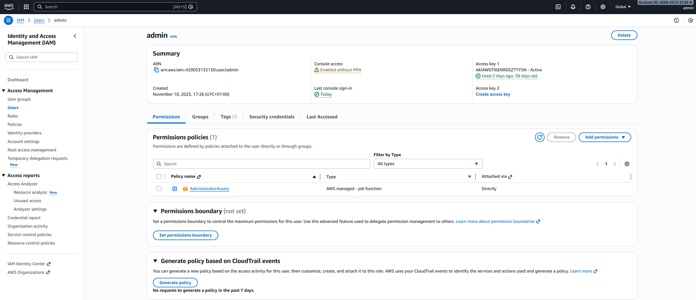
*Rys. 3.1.1. Konfiguracja dedykowanego użytkownika IAM (`admin`) z uprawnieniami `AdministratorAccess`.*

*   **Tożsamość dla potoku CI/CD:** Dla potoku w GitHub Actions stworzono oddzielnego, dedykowanego użytkownika IAM (`github-actions-deployer`). Dołączono do niego określony zestaw polityk uprawnień, niezbędny do budowania, wypychania obrazów do ECR i wdrażania aplikacji w Elastic Beanstalk.


*Rys. 3.1.2. Szczegóły uprawnień użytkownika `github-actions-deployer`, używanego przez potok CI/CD w GitHub Actions. Dołączone polityki (`AdministratorAccess-AWSElasticBeanstalk`, `AmazonEC2ContainerRegistryPowerUser`, `IAMReadOnlyAccess` oraz niestandardowa `GitHubActionsPassRoleForBookVibe`) nadają tylko te uprawnienia, które są niezbędne do automatycznego wdrażania aplikacji, realizując zasadę najmniejszych uprawnień.*

Za pomocą Terraform stworzono dedykowane role IAM dla poszczególnych usług AWS, aby mogły one bezpiecznie komunikować się między sobą:
*   **Rola serwisowa Elastic Beanstalk (`bookvibe-beanstalk-service-role`):** Posiada uprawnienia do zarządzania zasobami środowiska (np. monitorowanie stanu instancji, aktualizacje).
*   **Rola instancji EC2 (`bookvibe-beanstalk-ec2-role`):** Przypisana do maszyn wirtualnych, na których działają kontenery. Posiada wyłącznie uprawnienia do:
    *   pobierania obrazów Docker z Amazon ECR (`AmazonEC2ContainerRegistryReadOnly`);
    *   wysyłania logów i metryk do CloudWatch (`CloudWatchAgentServerPolicy`);
    *   zarządzania środowiskiem wielokontenerowym (`AWSElasticBeanstalkMulticontainerDocker`).

Taki podział tożsamości na wiele poziomów jest kluczową praktyką w zakresie bezpieczeństwa. Oddzielenie ról administratora od ról w automatyzowanym procesie CI/CD zmniejsza ryzyko w sytuacji, gdy klucze dostępu potoku zostały skompromitowane; atakujący mógłby jedynie wdrożyć nową wersję aplikacji, ale nie miałby możliwości zmiany innych zasobów na koncie. Stosowanie ról dla usług AWS to rozwiązanie, które sprawia, że nie ma potrzeby przechowywania kluczy dostępu na instancjach EC2, co znacznie zwiększa poziom ochrony.

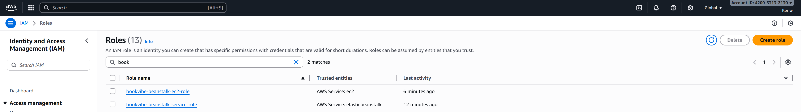
*Rys. 3.1.3. Role IAM stworzone za pomocą Terraform dla usług Elastic Beanstalk, zapewniające uprawnienia zgodne z zasadą najmniejszych uprawnień.*

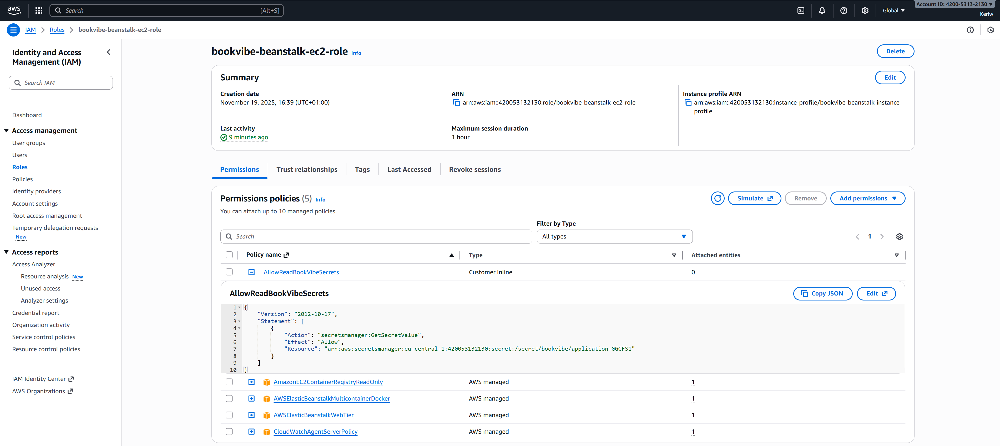
*Rys. 3.1.4. Szczegóły uprawnień dla roli bookvibe-beanstalk-ec2-role. Widoczne są polityki, nadające instancjom EC2 dostęp tylko do niezbędnych zasobów, takich jak EC2, CloudWatch, Elastic Beanstalk i Secrets Manager.*

#### 3.2. Bezpieczeństwo i segmentacja sieci

Infrastruktura sieciowa została zaprojektowana w ramach dedykowanej sieci wirtualnej VPC (`bookvibe-vpc`) (`10.0.0.0/16`).

1.  **Podsieci:** Sieć została podzielona na podsieci publiczne i prywatne, rozmieszczone w dwóch strefach dostępności:
    *   **Podsieci publiczne:** Posiadają dostęp do internetu poprzez Internet Gateway. Umieszczono w nich zasoby, które muszą być publicznie dostępne, tj. Application Load Balancer oraz instancje EC2 środowiska Elastic Beanstalk.
    *   **Podsieci prywatne:** Są odizolowane od publicznego internetu. Nie mają bezpośredniej trasy do Internet Gateway. Umieszczono w nich wrażliwe zasoby warstwy danych: bazę danych RDS (MySQL) oraz cache Redis (ElastiCache). Dostęp wychodzący do internetu (np. w celu pobrania aktualizacji) jest możliwy przez NAT Gateway umieszczony w podsieci publicznej.
2.  **Grupy bezpieczeństwa:** Zdefiniowano reguły, aby kontrolować ruch między warstwami:
    *   **Dostęp do bazy danych (RDS):** Grupa `bookvibe-db-sg` zezwala na ruch przychodzący na porcie 3306 (MySQL) wyłącznie ze źródła, którym jest grupa bezpieczeństwa instancji aplikacji (`bookvibe-beanstalk-sg`).
    *   **Dostęp do Redis:** Grupa `bookvibe-redis-sg` zezwala na ruch przychodzący na porcie 6379 (Redis) wyłącznie ze źródła `bookvibe-beanstalk-sg`.
    *   **Dostęp do aplikacji:** Grupa `bookvibe-beanstalk-sg` zezwala na ruch przychodzący na porcie 80 (HTTP) z dowolnego miejsca (co oznacza ruch z Load Balancera).
    *   **Dostęp SSH:** Dostęp na porcie 22 (SSH) do instancji EC2 jest ograniczony do jednego, zdefiniowanego adresu IP administratora.

Izolacja warstwy danych w podsieciach prywatnych jest najważniejszym krokiem w celu ochrony przed bezpośrednimi atakami z internetu. Precyzyjne reguły grup bezpieczeństwa dodatkowo ograniczają powierzchnię ataku, zapewniając, że poszczególne komponenty systemu mogą komunikować się tylko ze sobą w autoryzowany sposób, zgodnie z zasadą najmniejszych uprawnień na poziomie sieci.

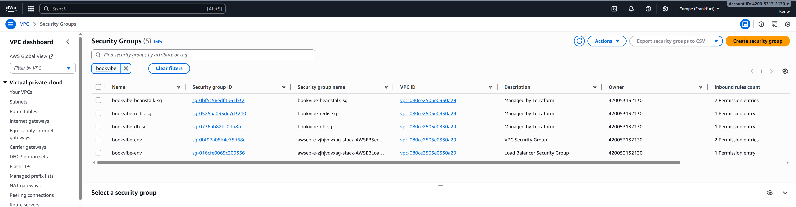
*Rys. 3.2.1. Grupy bezpieczeństwa stworzone dla poszczególnych warstw aplikacji w celu izolacji sieciowej.*

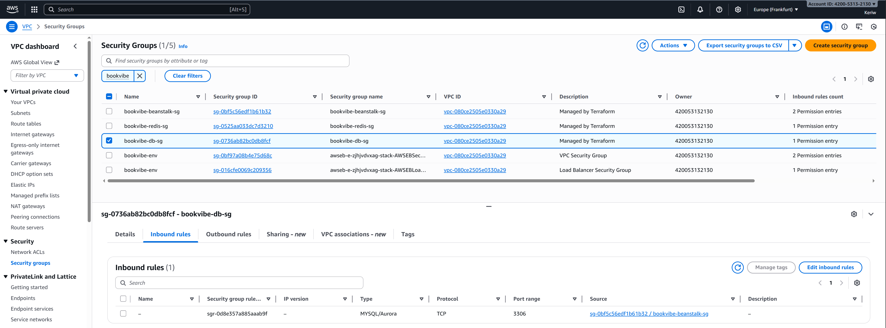
*Rys. 3.2.2. Reguły przychodzące dla grupy bezpieczeństwa bazy danych.*

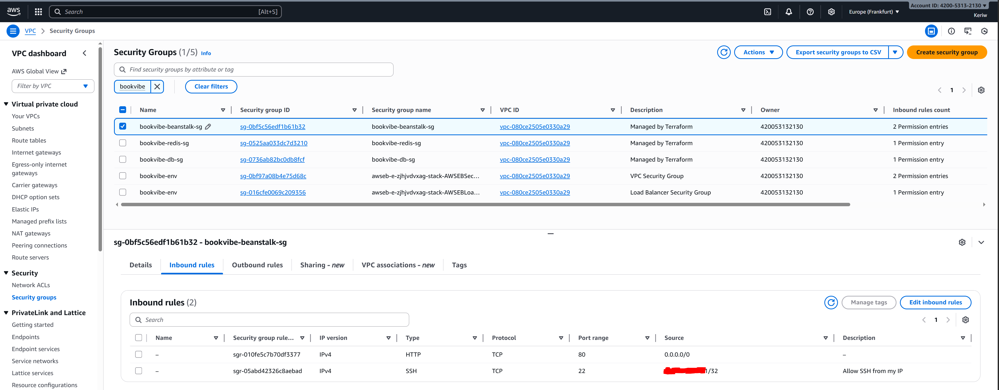
*Rys. 3.2.3. Reguły przychodzące dla grupy bezpieczeństwa instancji aplikacyjnych.*

Poniższy zrzut ekranu przedstawia tabelę routingu dla podsieci prywatnych, potwierdzając, że cały ruch wychodzący jest kierowany przez NAT Gateway.

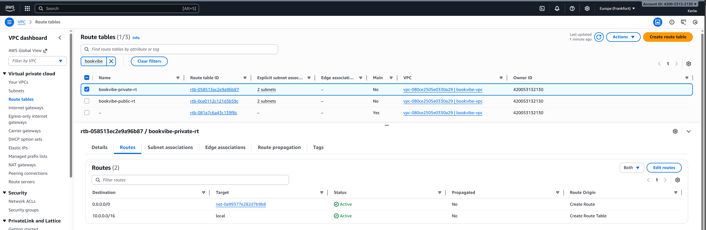
*Rys. 3.2.4. Tabela routingu dla podsieci prywatnych.*

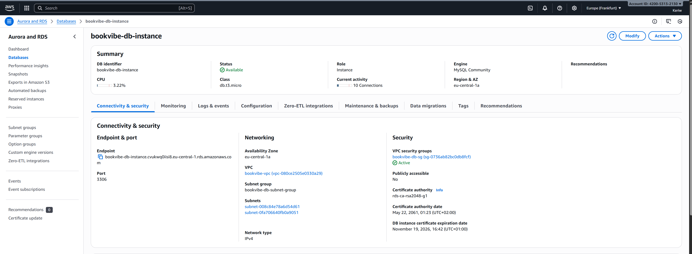
*Rys. 3.2.5. Konfiguracja sieciowa instancji bazy danych RDS. Instancja została umieszczona w podsieciach prywatnych i nie jest publicznie dostępna.*

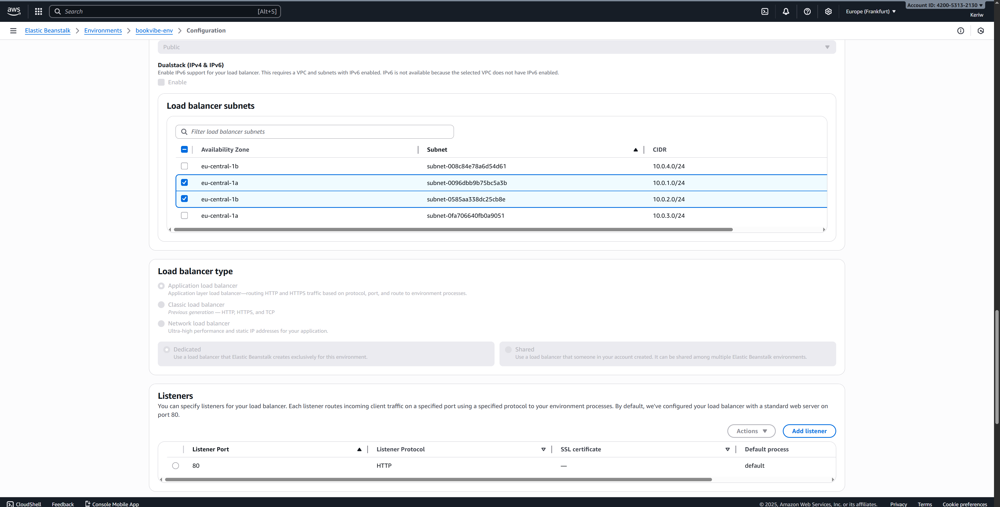
*Rys. 3.2.6. Konfiguracja Application Load Balancera w środowisku Elastic Beanstalk.*

#### 3.3. Szyfrowanie danych w spoczynku

W celu ochrony danych przed nieautoryzowanym dostępem na poziomie fizycznym, włączono szyfrowanie "at rest".

*   **Baza danych (RDS):** Instancja bazy danych została skonfigurowana z atrybutem `storage_encrypted = true`, co zapewnia szyfrowanie wszystkich przechowywanych danych i snapshotów za pomocą AWS KMS.

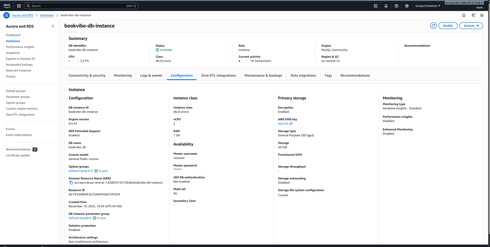
*Rys. 3.3.1. Potwierdzenie włączenia szyfrowania danych w spoczynku dla instancji bazy danych RDS.*

*   **Dyski maszyn wirtualnych (EBS):** Dodatkowo, w celu pełnego zabezpieczenia środowiska, włączono domyślne szyfrowanie dla wszystkich nowo tworzonych wolumenów EBS.

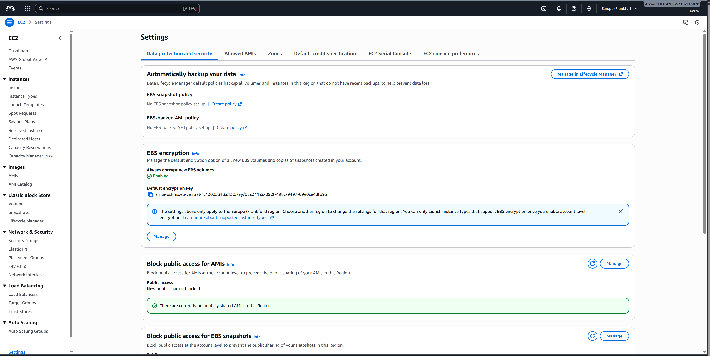
*Rys. 3.3.2. Szyfrowanie EBS*

Szyfrowanie danych w spoczynku jest standardem bezpieczeństwa i wymogiem wielu regulacji. Aktywacja tej funkcji w usługach zarządzanych AWS (jak RDS) odbywa się bez wpływu na wydajność i zapewnia, że dane, logi oraz snapshoty są automatycznie szyfrowane przy użyciu kluczy zarządzanych przez usługę AWS Key Management Service (KMS). Włączenie domyślnego szyfrowania EBS gwarantuje, że również dyski systemowe instancji tworzonych przez Elastic Beanstalk są chronione.

#### 3.4. Backup i Disaster Recovery

Strategia odtwarzania po awarii opiera się na dwóch filarach: odtwarzalności infrastruktury i aplikacji oraz backupie danych.

*   **Infrastruktura i aplikacja:** Dzięki podejściu IaC i przechowywaniu obrazów Docker w ECR, całe środowisko aplikacyjne jest w pełni odtwarzalne z kodu. Procedura odtworzenia polega na ponownym uruchomieniu `terraform apply` oraz wdrożeniu ostatniej stabilnej wersji aplikacji z ECR.
*   **Dane (RDS):** Konfiguracja RDS została przygotowana do włączenia automatycznych backupów (`backup_retention_period`). Ze względu na ograniczenia darmowego tieru AWS, retencja została ustawiona na 0. W środowisku produkcyjnym wystarczyłoby zmienić jej wartość, aby włączyć codzienne, cykliczne snapshoty. Procedura odtworzenia polegałaby na odtworzeniu bazy danych z wybranego snapshotu w konsoli AWS.

Podejście "infrastruktura jako kod" jest kluczowe w strategii Disaster Recovery, ponieważ eliminuje potrzebę tworzenia backupów samych maszyn wirtualnych. Instancje są traktowane jako ulotne i łatwo zastępowalne. Ważne jest jedynie regularne tworzenie kopii zapasowych stanu, czyli bazy danych.

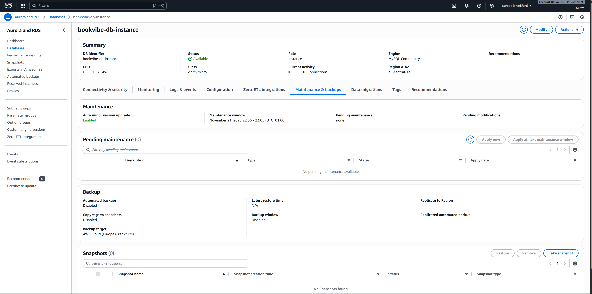
*Rys. 3.4.1. Konfiguracja backupu dla instancji RDS.*

Wykonano manualny snapshot bazy danych, który może posłużyć w procesie odtworzenia z niego nowej instancji bazy danych.

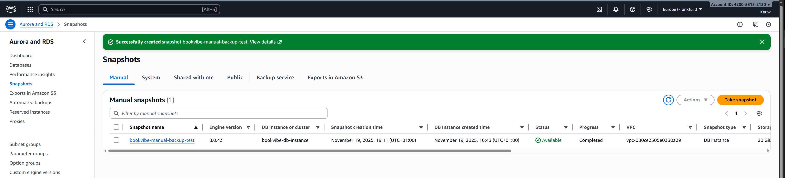
*Rys. 3.4.2. Manualny snapshot bazy danych.*

#### 3.5. Podstawowy monitoring

Monitoring kluczowych metryk środowiska jest realizowany za pomocą AWS CloudWatch, który jest domyślnie zintegrowany z użytymi usługami.

*   **Elastic Beanstalk:** Automatycznie raportuje stan środowiska (`Health`), użycie CPU, ruch sieciowy instancji EC2 oraz metryki Application Load Balancera.
*   **RDS i ElastiCache:** Automatycznie wysyłają do CloudWatch metryki takie jak użycie CPU, wolne miejsce na dysku i wykorzystanie pamięci.


*Rys. 3.5.1. Przykładowy wykres metryki CPUUtilization dla jednej z instancji EC2 zarządzanych przez Elastic Beanstalk, wizualizowany w usłudze AWS CloudWatch. Integracja z CloudWatch jest domyślnie włączona, co pozwala na podstawowe monitorowanie wydajności i stanu maszyn wirtualnych.*

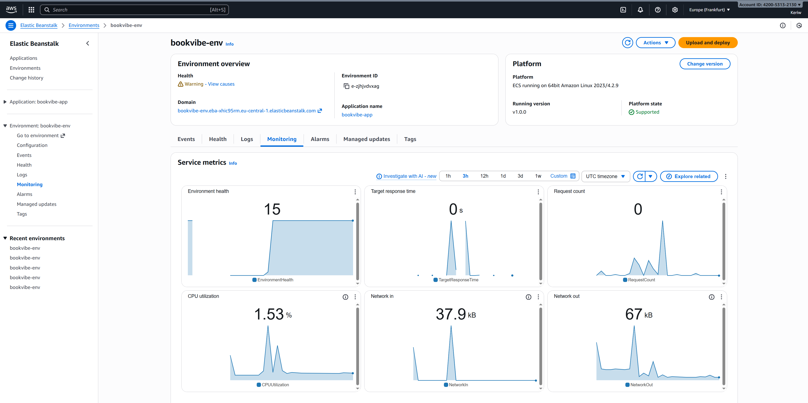
*Rys. 3.5.2. Panel monitorowania i stanu (Health) w konsoli Elastic Beanstalk. Usługa ta agreguje kluczowe metryki z CloudWatch, zapewniając szybki wgląd w wydajność i stabilność działającej aplikacji.*

#### 3.6. Infrastruktura jako Kod (IaC) i DevSecOps

*   **Infrastruktura jako Kod:** Cała infrastruktura została zdefiniowana w plikach Terraform (`.tf`). Umożliwia to automatyzację, wersjonowanie i powtarzalność procesu tworzenia środowiska.

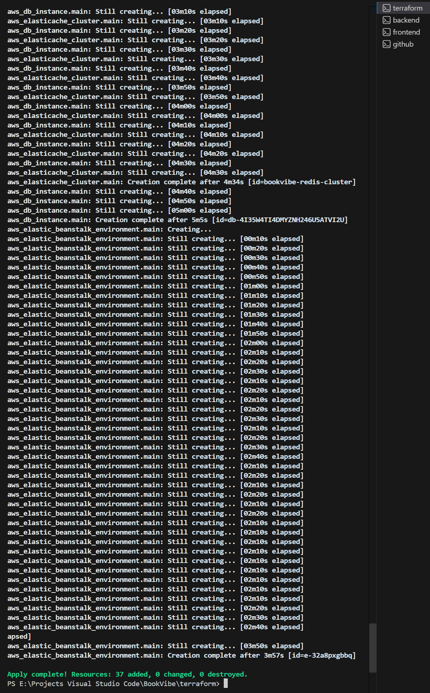
*Rys. 3.6.1. Potwierdzenie pomyślnego utworzenia i skonfigurowania całej infrastruktury chmurowej za pomocą jednego polecenia terraform apply.*

*   **Potok CI/CD (DevSecOps):** Zaimplementowano potok w GitHub Actions (definicja w `.github/workflows/deploy.yml`), który realizuje następujące kroki:
    1.  Uwierzytelnienie w AWS za pomocą bezpiecznych sekretów.
    2.  Zbudowanie obrazów Docker dla frontendu i backendu.
    3.  Skanowanie bezpieczeństwa, gdzie każdy obraz jest skanowany w poszukiwaniu podatności (CVE) za pomocą Trivy. Wdrożenie jest blokowane w przypadku znalezienia krytycznych lub wysokich podatności.
    4.  Wypchnięcie zweryfikowanych obrazów do prywatnego repozytorium Amazon ECR.
    5.  Wygenerowanie pliku `Dockerrun.aws.json` z tagami nowych obrazów.
    6.  Automatyczne wdrożenie nowej wersji aplikacji na środowisku Elastic Beanstalk.

Pozwal to na automatyzację procesów, redukcję ryzyka ludzkiego błędu i wprowadza bramkę bezpieczeństwa, która zapobiega wdrażaniu oprogramowania ze znanymi podatnościami.

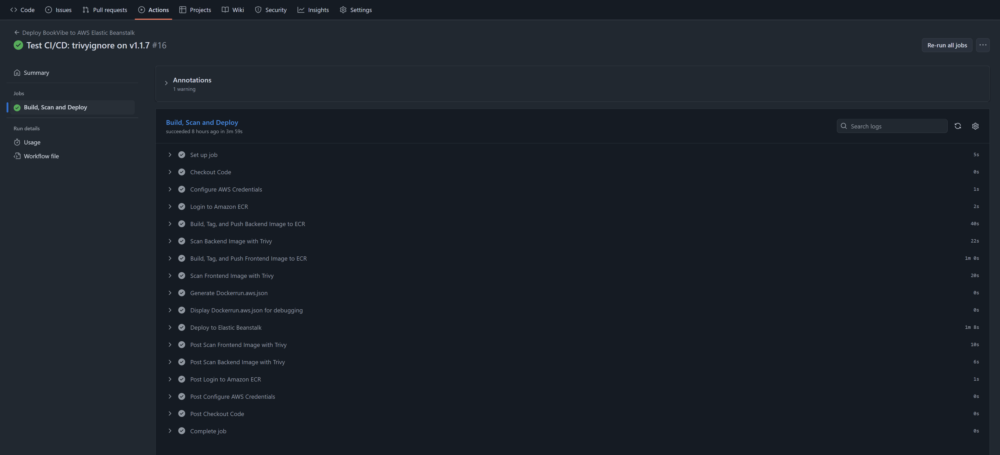
*Rys. 3.6.2. Widok pomyślnie zakończonego potoku CI/CD w GitHub Actions. Każdy push do gałęzi main automatycznie uruchamia proces budowania, skanowania i wdrażania aplikacji.*


*Rys. 3.6.3. Wynik działania kroku skanowania bezpieczeństwa obrazu Docker za pomocą narzędzia Trivy. W ramach potoku CI/CD, każda nowa wersja aplikacji jest analizowana pod kątem znanych podatności. Wdrożenie jest kontynuowane tylko w przypadku, gdy skan nie wykryje krytycznych lub wysokich zagrożeń.*

Dowodem na pełną automatyzację wdrożenia jest lista wersji aplikacji w konsoli AWS Elastic Beanstalk. Etykiety wersji (np. `v-dd9c28b3d455c5145785a6a2433a88b3420e6501`) zawierają unikalny identyfikator SHA commita z Git, co potwierdza, że zostały one stworzone i wdrożone automatycznie przez potok CI/CD, a nie ręcznie.

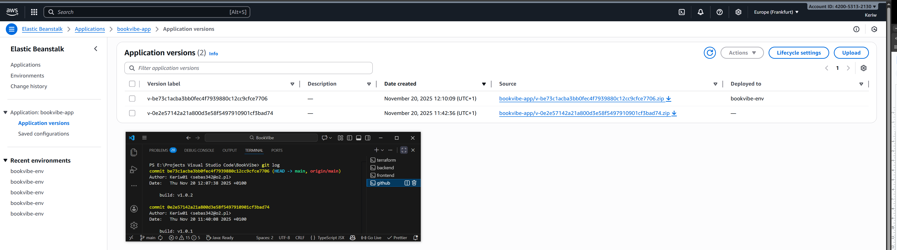
*Rys. 3.6.4. Lista wersji aplikacji w środowisku Elastic Beanstalk.*

### 4. Instrukcja wdrożenia i weryfikacji

Poniższa instrukcja opisuje proces wdrożenia:

#### Wymagania wstępne
*   Utworzony użytkownik `admin` przez `root` (**IAM** -> **Users** -> **Create user**) z uprawnieniami (`AdministratorAccess`). 
*   Zainstalowany i skonfigurowany [AWS CLI](https://aws.amazon.com/cli/).
*   Zainstalowany [Terraform](https://developer.hashicorp.com/terraform/install) (v1.13.5, AWS provider: v5.0).

### Krok 1: Konfiguracja sekretów w AWS Secrets Manager

Aplikacja wykorzystuje AWS Secrets Manager do bezpiecznego przechowywania wrażliwych danych konfiguracyjnych. Przed uruchomieniem Terraform należy ręcznie stworzyć sekret.

1.  Zaloguj się do konsoli AWS i przejdź do usługi **Secrets Manager**.
2.  Kliknij **"Store a new secret"**.
3.  Wybierz typ sekretu: **"Other type of secret"**.
4.  W sekcji **"Key/value pairs"**, wybierz zakładkę **"Plaintext"**, wklej i uzupełnij poniższy kod JSON:
    ```json
    {
      "spring.datasource.password": "<database_password>",
      "spring.data.redis.ssl.enabled": "false",
      "security.jwt.secret-key": "<secret_key_64_characters_256_bits>",
      "security.jwt.expiration-time": "3600000",
      "security.jwt.refresh-token.expiration-time": "604800000"
    }
    ```
    **secret-key** można wygenerować na [JWT Secrets generator](https://jwtsecrets.com/#generator)
5.  Kliknij **"Next"**.
6.  Secret name: `/secret/bookvibe/application`.

### Krok 2: Konfiguracja zmiennych lokalnych Terraform

Aby bezpiecznie zarządzać danymi specyficznymi dla użytkownika (jak adres IP), projekt wykorzystuje zmienne Terraform.

1.  W katalogu `terraform/` stwórz plik o nazwie **`terraform.tfvars`**.
2.  Wklej do niego poniższą zawartość, podmieniając wartość `my_ip_address` na swój publiczny adres IP z dopiskiem `/32`. Adres IP można sprawdzić np. na stronie [What is my IP](https://www.whatismyip.com/).
    ```
    my_ip_address = "adres/32" 
    ```

### Krok 3: Uruchomienie infrastruktury z Terraform
Ten krok tworzy całą niezbędną infrastrukturę w chmurze AWS, w tym repozytoria dla obrazów Docker w Amazon ECR.

1.  Przejdź do katalogu `terraform`.
2.  Uruchom `terraform init`, a następnie `terraform apply`.

### Krok 4: Wdrożenie zautomatyzowane (CI/CD)

Wszystkie zmiany w kodzie będą wdrażane automatycznie przez potok CI/CD.

1.  **Konfiguracja sekretów GitHub:**
    *   Stwórz specjalnego użytkownika `github-actions-deployer` (**IAM** -> **Users** -> **Create user**) z uprawnieniami (`AdministratorAccess-AWSElasticBeanstalk`, `AmazonEC2ContainerRegistryPowerUser`, `IAMReadOnlyAccess`) oraz **"Inline Policy"** jako `GitHubActionsPassRoleForBookVibe`: 
        ```bash
        {
            "Version": "2012-10-17",
            "Statement": [
                {
                    "Effect": "Allow",
                    "Action": "iam:PassRole",
                    "Resource": [
                        "arn:aws:iam::<ID_KONTA_AWS>:role/bookvibe-beanstalk-ec2-role",
                        "arn:aws:iam::<ID_KONTA_AWS>:role/bookvibe-beanstalk-service-role"
                    ]
                }
            ]
        }
        ```
    *   Stwórz dla niego w (**IAM** -> **Users** -> **github-actions-deployer**) **"Access Key"**, który będzie potrzebny do wklejenia.
    *   Przejdź do ustawień swojego repozytorium na GitHubie (**Settings** -> **Secrets and variables** -> **Actions**).
    *   Stwórz dwa sekrety: `AWS_ACCESS_KEY_ID` oraz `AWS_SECRET_ACCESS_KEY` dla użytkownika IAM z uprawnieniami do wdrożenia i wklej wartości.
2.  **Uruchomienie potoku:**
    * Potok powinien wykonać się z sukcesem jeżeli Trivy nie wykryje żadnych podatności, w celu przetestowania poprawności działania potoku można w pliku `.trivyignore` wymienić wykryte podatności przez co z sukcesem zakończy się wdrażanie.
    *   Wypchnij dowolną zmianę do gałęzi `main` repozytorium GitHub (`git push origin main`).
    *   Spowoduje to automatyczne uruchomienie potoku zdefiniowanego w `.github/workflows/deploy.yml`.
3.  **Weryfikacja:**
    *   Można obserwować przebieg potoku w zakładce "Actions" w repozytorium GitHub. Potok automatycznie zbuduje, przeskanuje, wypchnie i wdroży nową wersję aplikacji.
    *   Po pomyślnym zakończeniu potoku, należy odświeżyć stronę aplikacji w przeglądarce, aby zobaczyć wprowadzone zmiany.

### Dostęp zdalny do instancji (SSH z PuTTY)

Aby uzyskać dostęp do instancji EC2 (np. sprawdzenia logów), należy połączyć się przez SSH. Dostęp jest ograniczony do adresu IP administratora zdefiniowanego w pliku `network.tf`.

### Krok 1: Stworzenie pary klucza do użycia w  PuTTY (.ppk)

1.  **Wygeneruj parę kluczy:** W konsoli AWS **EC2** -> **Key pairs** -> **Create key pair**, należy wpisać nazwę: `bookvibe-ssh-key`, typ `RSA`, format `.ppk`, pobrać i zapisać lokalnie.

### Krok 2: Konfiguracja połączenia w PuTTY

1.  **Znajdź adres IP:** W konsoli AWS, **EC2** -> **Instances** i skopiuj **Public IPv4 address** instancji.
2.  **Uruchom PuTTY** i w sekcji **Session**:
    *   **Host Name (or IP address):** Wklej skopiowany adres IP.
    *   **Port:** `22`.
3.  W sekcji **Connection -> Data**:
    *   **Auto-login username:** Wpisz `ec2-user`.
4.  W sekcji **Connection -> SSH -> Auth -> Credentials**:
    *   **Private key file for authentication:** Wskaż swój plik `.ppk` wygenerowany w poprzednim kroku.
6.  Kliknij **"Open"**, aby nawiązać połączenie. Przy pierwszym połączeniu należy zaakceptować klucz hosta.